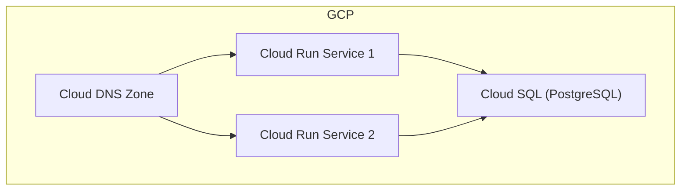

# GCP Web Servers, Cloud SQL, and DNS Terraform Project

## Overview
This Terraform project provisions core infrastructure on Google Cloud Platform (GCP):
- **Two Cloud Run web services** (independent, scalable, public)
- **A managed PostgreSQL Cloud SQL instance** (production-ready, large data volumes)
- **Cloud DNS zone and records** (routes traffic to Cloud Run endpoints)

All resources are orchestrated from the root module, with logical separation into submodules for Cloud Run, Cloud SQL, and DNS.

---

## Architecture Diagram


---

## Directory Structure
```
.
├── main.tf                # Root orchestration
├── variables.tf           # Root input variables
├── outputs.tf             # Root outputs
├── versions.tf            # Terraform & provider versions
├── terraform.tfvars       # Example variable values (edit this!)
├── cloud_run/             # Cloud Run module
├── cloud_sql/             # Cloud SQL module
└── dns/                   # Cloud DNS module
```

---

## Usage Instructions

### 1. Prerequisites
- GCP project created
- Terraform >= 1.5.0 installed
- Google Cloud SDK installed and authenticated (`gcloud auth application-default login`)

### 2. Configure Inputs
Edit `terraform.tfvars` and set:
- `project_id`: Your GCP project ID
- `region`: GCP region (default: `us-central1`)
- `db_password`: Set a secure password (do NOT commit secrets)
- `cloud_run_service_account_email`: Service account email with Cloud SQL Client role
- DNS variables: Set your domain and DNS names for each web service

### 3. Initialize & Apply
```
terraform init
terraform plan
terraform apply
```

### 4. Outputs
- Cloud Run service URLs
- Cloud SQL instance connection name
- DNS zone name, domain, and name servers

## Terraform Documentation Found
| Metric                               | Value                   |
|--------------------------------------|-------------------------|
| Total Files Analyzed                 | 1,725         |
| Total Results Found                  | 30         |
| Total Selected Files                 | 4           |

## Documentation Links
- [resources cloud_run_service_iam.html.markdown](https://registry.terraform.io/providers/hashicorp/google/latest/docs/resources/cloud_run_service_iam)
- [terraform-google-cloud-dns README.md](https://github.com/terraform-google-modules/terraform-google-cloud-dns)
- [postgresql README.md](https://github.com/terraform-google-modules/terraform-google-sql-db/tree/master/modules/postgresql)
- [resources cloud_run_service.html.markdown](https://registry.terraform.io/providers/hashicorp/google/latest/docs/resources/cloud_run_service)

---

## Modifying the Project
- To change container images, edit the `web_server_1_image` and `web_server_2_image` variables.
- To use a different region or database tier, update the relevant variables in `terraform.tfvars`.
- For production, use secure secret management for database credentials.

---
    <td class="name">
      
      <span class="arrow">&#8627;</span>
      Memory allocation time
    </td>
    
      <td colspan="3" class="usage-cost">Cost depends on usage: $0.000002 per GiB-seconds</td>
    
  </tr>

  
    
  <tr class="cost-component">
    <td class="name">
      
      <span class="arrow">&#8627;</span>
      Number of requests
    </td>
    
      <td colspan="3" class="usage-cost">Cost depends on usage: $0.0000004 per requests</td>
    
  </tr>

  
  

      
        
  
  <tr class="resource top-level">
    <td class="name">
      
      
      module.dns.module.cloud_dns.google_dns_record_set.cloud-static-records[&#34;app1.example.com./CNAME&#34;]
    </td>
    
  
    <td class="monthly-quantity"></td>
  
  
    <td class="unit"></td>
  
  
  
  
    <td class="monthly-cost"></td>
  

  </tr>
  
  
  
    
  <tr class="cost-component">
    <td class="name">
      
      <span class="arrow">&#8627;</span>
      Queries
    </td>
    
      <td colspan="3" class="usage-cost">Cost depends on usage: $0.40 per 1M queries</td>
    
  </tr>

  
  

      
        
  
  <tr class="resource top-level">
    <td class="name">
      
      
      module.dns.module.cloud_dns.google_dns_record_set.cloud-static-records[&#34;app2.example.com./CNAME&#34;]
    </td>
    
  
    <td class="monthly-quantity"></td>
  
  
    <td class="unit"></td>
  
  
  
  
    <td class="monthly-cost"></td>
  

  </tr>
  
  
  
    
  <tr class="cost-component">
    <td class="name">
      
      <span class="arrow">&#8627;</span>
      Queries
    </td>
    
      <td colspan="3" class="usage-cost">Cost depends on usage: $0.40 per 1M queries</td>
    
  </tr>

  
  

      
      <tr class="total">
        <td class="name" colspan="3">Project total</td>
        <td class="monthly-cost">$73.81</td>
      </tr>
    </tbody>
  </table>

    

    <table class="overall-total">
      <tbody>
        <tr class="total">
          <td class="name" colspan="3">Overall total</td>
          <td class="monthly-cost">$73.81</td>
        </tr>
      </tbody>
    </table>

    <div class="warnings">
      <p>11 cloud resources were detected:<br />∙ 6 were estimated<br />∙ 5 were free</p>
    </div>
  </body>
</html>
