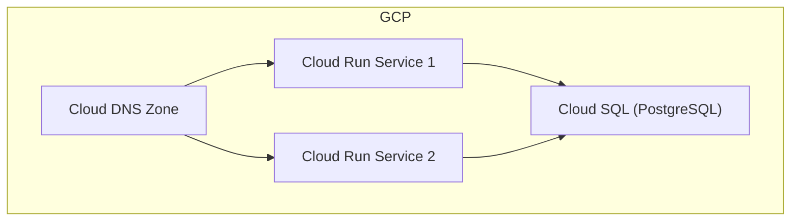

# GCP Web Servers, Cloud SQL, and DNS Terraform Project

## Overview
This Terraform project provisions core infrastructure on Google Cloud Platform (GCP):
- **Two Cloud Run web services** (independent, scalable, public)
- **A managed PostgreSQL Cloud SQL instance** (production-ready, large data volumes)
- **Cloud DNS zone and records** (routes traffic to Cloud Run endpoints)

All resources are orchestrated from the root module, with logical separation into submodules for Cloud Run, Cloud SQL, and DNS.

---

## Architecture Diagram


---

## Directory Structure
```
.
├── main.tf                # Root orchestration
├── variables.tf           # Root input variables
├── outputs.tf             # Root outputs
├── versions.tf            # Terraform & provider versions
├── terraform.tfvars       # Example variable values (edit this!)
├── cloud_run/             # Cloud Run module
├── cloud_sql/             # Cloud SQL module
└── dns/                   # Cloud DNS module
```

---

## Usage Instructions

### 1. Prerequisites
- GCP project created
- Terraform >= 1.5.0 installed
- Google Cloud SDK installed and authenticated (`gcloud auth application-default login`)

### 2. Configure Inputs
Edit `terraform.tfvars` and set:
- `project_id`: Your GCP project ID
- `region`: GCP region (default: `us-central1`)
- `db_password`: Set a secure password (do NOT commit secrets)
- `cloud_run_service_account_email`: Service account email with Cloud SQL Client role
- DNS variables: Set your domain and DNS names for each web service

### 3. Initialize & Apply
```
terraform init
terraform plan
terraform apply
```

### 4. Outputs
- Cloud Run service URLs
- Cloud SQL instance connection name
- DNS zone name, domain, and name servers

---

## Modifying the Project
- To change container images, edit the `web_server_1_image` and `web_server_2_image` variables.
- To use a different region or database tier, update the relevant variables in `terraform.tfvars`.
- For production, use secure secret management for database credentials.

---

## Next Steps & Recommendations
- Edit `terraform.tfvars` with your real values before running.
- Use the Terraform Validate button to check/fix any errors.
- For production: add VPC, IAM, and monitoring as needed.
- See each module's README for advanced configuration.
